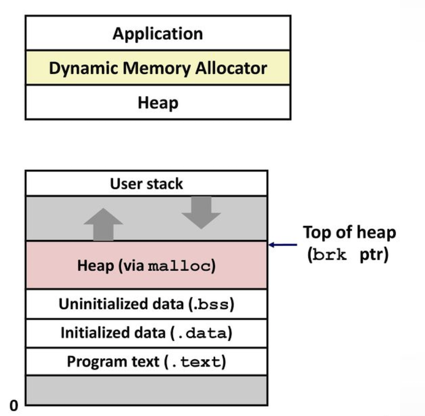

# Dynamic-Memory-Provider (Project 3)
A dynamic memory provider keeps track of which bytes are currently allocated and which are available for use and generate memory for the user.

## Equipment:

Linux machine

## Introduction:

A memory allocator needs to keep track of which bytes are currently allocated and which are available for use. This page introduces the implementation and conceptual details of building an allocator, i.e. the actual code that implements `malloc`, `calloc`, `realloc` and `free`.
In this project, we are writing integers and pointers into memory that we already control so that we can later consistently hop from one address to the next. 
Here, we will develop a custom memory allocator. malloc isn’t provided by the OS, nor is it a system call; it is a library function that uses system calls to allocate and deallocate memory. In most implementations of malloc, these system calls involve at least one of:

```bash
sbrk
mmap

```

sbrk is the simplest of the two – simply give it a size and it will increase the program break (a.k.a. bound). On the other hand, mmap gives us more control but requires more work to use. The malloc implementation we’ve been using on your Linux installations will use sbrk for small allocations and mmap for larger ones.

To simplify our allocator, we will only be using mmap, and we’ll allocate entire regions of memory at a time. The size of each region should be a multiple of the system page size; this means that if a program executes malloc(1) for a single byte of memory and our machine has a page size of 4096, we’ll allocate a region of 4096 bytes instead. Consequently, if the user requests 4097 bytes then we will allocate two regions’ worth of memory.



[Reference](https://www.cs.usfca.edu/~mmalensek/cs326/assignments/project-3.html )

## Implemented Module 

The major module to complete the memory allocator project are listed here: 

### 1) first_fit():
These are Contiguous memory allocation techniques. First-Fit Memory Allocation: This method keeps the free/busy list of jobs organized by memory location, low-ordered to high-ordered memory. In this method, the first job claims the first available memory with space more than or equal to its size.

### 2) best_fit():
The allocator places a process in the smallest block of unallocated memory in which it will fit. For example, suppose a process requests 12KB of memory and the memory manager currently has a list of unallocated blocks of 6KB, 14KB, 19KB, 11KB, and 13KB blocks.

### 3) worth_fit():
Worst Fit allocates a process to the partition which is largest sufficient among the freely available partitions available in the main memory. If a large process comes at a later stage, then memory will not have space to accommodate it.

### 4) malloc():
Dynamic memory allocation refers to performing manual memory management for dynamic memory allocation.

### 5) calloc():
Calloc is a contiguous memory allocation function that allocates multiple memory blocks at a time initialized to 0.

### 6) realloc():
In other words, if the memory previously allocated with the help of malloc or calloc is insufficient, realloc can be used to dynamically re-allocate memory.
### 7) free():
A free list is a data structure used in a scheme for dynamic memory allocation. It operates by connecting unallocated regions of memory together in a linked list, using the first word of each unallocated region as a pointer to the next.

### 8) print_memory():
To visualize and test designed memory allocation and for better understanding of memory allocation. 

While first_fit(), best_fit() and worst_fit() algorithm introduced different approach to allocate memory print_memory helps to understand and visualize the memory allocation.

## Build
The project can be built using the following command:

```bash
make
```

## Run
The project can be run using the following command:

```bash
LD_PRELOAD=$(pwd)/allocator.so  <command>
```
Example:

```bash
LD_PRELOAD=$(pwd)/allocator.so  ls /
```
## Test
The project can be run using the following command:

```bash
make test
make testupdate
```

To compile and use the allocator:

```bash
make
LD_PRELOAD=$(pwd)/allocator.so ls /
```

(in this example, the command `ls /` is run with the custom memory allocator instead of the default).

There are 2 approaches for testing:

### Integration Testing:
We have defined an integration test for some modules.
We can run the following command for integration testing: 
```bash
gcc -Wall print_test.c allocator.c allocator.h
LD_PRELOAD=$(pwd)/allocator.so ./a.out 

gcc -Wall best_fit_test.c allocator.c allocator.h
LD_PRELOAD=$(pwd)/allocator.so ./a.out 

gcc -Wall first_fit_test.c allocator.c allocator.h
LD_PRELOAD=$(pwd)/allocator.so ./a.out 
```

### System Testing: 
To execute the test cases, use `make test`. To pull in updated test cases, run `make testupdate`. You can also run a specific test-case instead of all of them:


#### Run all test cases:

```bash
make test
```
#### Run a specific test case:
```bash
make test run=4
```

#### Run a few specific test cases (4, 8, and 12 in this case):
```bash
make test run='4 8 12'
```
